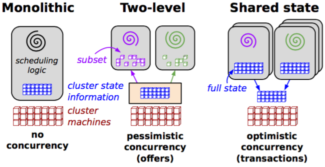

# Something About Scheduler

This report compares three popular solutions to schedule containers: Docker Swarm, Google Kubernetes and Apache Mesos & Marathon. 

## What is scheduler

Large-scale compute clusters are expensive, so it is important to use them well. Utilization and efficiency can be increased by running a mix of workloads on the same machines: CPU- and memory-intensive jobs, small and large ones, and a mix of batch and low-latency jobs – ones that serve end user requests or provide infrastructure services such as storage, naming or locking. This consolidation reduces the amount of hardware required for a workload, but it makes the scheduling problem (assigning jobs to machines) more complicated: a wider range of requirements and policies have to be taken into account.

there are three main scheduler architectures presented in the paper[2]:

Monolithic and Two-Level are two prevalent scheduler architectures. 

### Monolithic

Monolithic schedulers are composed of a single scheduling agent handling all the requests, they are commonly used in high-performance computing. A monolithic scheduler generally applies a single-algorithm implementation for all incoming jobs thus running different scheduling logic depending on job types is difficult.

Apache Hadoop YARN, a popular architecture for Hadoop that delegates many scheduling functions to per-application components, is a monolithic scheduler architecture due to the fact that the resource requests from application masters have to be sent to a single global scheduler in the resource master.

### Two-Level

A two-level scheduler adjusts the allocation of resources to each scheduler dynamically using a central coordinator to decide how many resources each sub-cluster can have, it is used in Mesos and was used for Hadoop-on-Demand (now replaced by YARN).

With this architecture, the allocator avoids conflicts by offering a given resource to only one framework at a time and attempts to achieve dominant resource fairness by choosing the order and the sizes of the resources it offers. Only one framework is examining a resource at a time thus the concurrency control is called pessimistic, a strategy that is less error-prone but slower compared to an optimistic concurrency control offering a resource to many frameworks at the same time.

### Shared-State

Omega grants each scheduler full access to the entire cluster, allowing them to compete in a free-for-all manner. There is no central resource allocator as all of the resource-allocation decisions take place in the schedulers. There is no central policy-enforcement engine, individual schedulers are taking decisions in this variant of the two-level scheme.

By supporting independent scheduler implementations and exposing the entire allocation state of the schedulers, Omega can scale to many schedulers and works with different workloads with their own scheduling policies.

## Kubernetes, Mesos and Swarm

There are three scheduling frameworks: Kubernetes, Mesos & Marathon and Swarm. 

### Kubernetes

Kubernetes is an orchestration system for Docker containers using the concepts of ”labels” and ”pods” to group containers into logical units. Pods are the main difference between Kubernetes and the two other solutions, they are collections of co-located containers forming a service deployed and scheduled together. This approach simplifies the management of the cluster comparing to an affinitybased co-scheduling of containers (like Swarm and Mesos).

The Kubernetes scheduler runs as a process alongside the other master components such as the API server. Its interface to the API server is to watch for Pods with an empty PodSpec.NodeName, and for each Pod, it posts a Binding indicating where the Pod should be scheduled.

#### The scheduling process

The scheduler tries to find a node for each Pod, one at a time, as it notices
these Pods via watch. There are three steps. First it applies a set of "predicates" that filter out
inappropriate nodes. For example, if the PodSpec specifies resource requests, then the scheduler
will filter out nodes that don't have at least that much resources available (computed
as the capacity of the node minus the sum of the resource requests of the containers that
are already running on the node). Second, it applies a set of "priority functions"
that rank the nodes that weren't filtered out by the predicate check. For example,
it tries to spread Pods across nodes and zones while at the same time favoring the least-loaded
nodes (where "load" here is sum of the resource requests of the containers running on the node,
divided by the node's capacity).
Finally, the node with the highest priority is chosen
(or, if there are multiple such nodes, then one of them is chosen at random). The code
for this main scheduling loop is in the function `Schedule()` in
[plugin/pkg/scheduler/generic_scheduler.go](http://releases.k8s.io/HEAD/plugin/pkg/scheduler/generic_scheduler.go)

#### Scheduler extensibility

The scheduler is extensible: the cluster administrator can choose which of the pre-defined
scheduling policies to apply, and can add new ones. The built-in predicates and priorities are
defined in [plugin/pkg/scheduler/algorithm/predicates/predicates.go](http://releases.k8s.io/HEAD/plugin/pkg/scheduler/algorithm/predicates/predicates.go) and
[plugin/pkg/scheduler/algorithm/priorities/priorities.go](http://releases.k8s.io/HEAD/plugin/pkg/scheduler/algorithm/priorities/priorities.go), respectively.
The policies that are applied when scheduling can be chosen in one of two ways. Normally,
the policies used are selected by the functions `defaultPredicates()` and `defaultPriorities()` in
[plugin/pkg/scheduler/algorithmprovider/defaults/defaults.go](http://releases.k8s.io/HEAD/plugin/pkg/scheduler/algorithmprovider/defaults/defaults.go).
However, the choice of policies
can be overridden by passing the command-line flag `--policy-config-file` to the scheduler, pointing to a JSON
file specifying which scheduling policies to use. See
[examples/scheduler-policy-config.json](../../examples/scheduler-policy-config.json) for an example
config file. (Note that the config file format is versioned; the API is defined in
[plugin/pkg/scheduler/api](http://releases.k8s.io/HEAD/plugin/pkg/scheduler/api/)).
Thus to add a new scheduling policy, you should modify predicates.go or priorities.go,
and either register the policy in `defaultPredicates()` or `defaultPriorities()`, or use a policy config file.

In current Kubernetes design, there is only one default scheduler in a Kubernetes cluster. However it is common that multiple types of workload, such as traditional batch, DAG batch, streaming and user-facing production services, are running in the same cluster and they need to be scheduled in different ways. For example, in [Omega](http://research.google.com/pubs/pub41684.html) batch workload and service workload are scheduled by two types of schedulers: the batch workload is scheduled by a scheduler which looks at the current usage of the cluster to improve the resource usage rate and the service workload is scheduled by another one which considers the reserved resources in the cluster and many other constraints since their performance must meet some higher SLOs. [Mesos](http://mesos.apache.org/) has done a great work to support multiple schedulers by building a two-level scheduling structure. This proposal describes how Kubernetes is going to support multi-scheduler so that users could be able to run their user-provided scheduler(s) to enable some customized scheduling behavior as they need. As previously discussed in [#11793](https://github.com/kubernetes/kubernetes/issues/11793), [#9920](https://github.com/kubernetes/kubernetes/issues/9920) and [#11470](https://github.com/kubernetes/kubernetes/issues/11470), the design of the multiple scheduler should be generic and includes adding a scheduler name annotation to separate the pods.

### Mesos & Marathon

The purpose of Mesos is to build a scalable and efficient system that supports a wide array of both current and future frameworks. This is also the main issue: frameworks like Hadoop and MPI are developed independently thus it is not possible to do fine-grained sharing across frameworks.

The proposition of Mesos is to add a thin resource-sharing layer giving frameworks a common interface for accessing clusters resources. Mesos is delegating control over scheduling to the frameworks because many frameworks already implement sophisticated scheduling.

Four types of frameworks exist depending on the type of jobs you want to run on your cluster and some of them have native Docker support like Marathon. The support of Docker containers has been added in Mesos 0.20.0.

### Swarm

Docker Swarm is a container scheduler developed by Docker. The development of this cluster solution being managed by Docker offers advantages like the use of the standard Docker API. The architecture of a swarm is composed of two elements.

One machine plays the role of the manager, it runs an image of Swarm (like it would run any other Docker images), it is represented on the image by the whales and is responsible for scheduling the containers on the agents [4]. Swarm uses the same API as the Docker standard API, this means that running a container on a Swarm requires the same command as running it on a single machine. New flags are available but a developer can use a Swarm cluster without changing its workflow.

The swarm is also composed of multiple agents, also called nodes, that are just machines having a Docker remote API available for the Swarm manager by opening the correct ports when starting the Docker daemon [5]. Three of them are represented on the image. These machines will pull and run different images depending on the containers that the swarm scheduler assigns to them.

Each agent can have labels assigned when starting the docker daemon, these labels are key/value pairs giving details concerning the agent. These labels are used to filter the cluster when running a new container, further details are given later in this part.

#### Strategies
Three strategies (e.g. ways for the manager to select a node to run a container) are available in Swarm:

* strategy name: node selected
* spread: has the fewest containers, disregarding their states
* binpack: most packed (i.e. has the minimum amount of free CPU/RAM)
* random: chosen randomly

If multiple nodes are selected by the strategy, the scheduler chooses a random node among those. The strategy needs to be defined when starting the manager or the “spread” strategy will be used by default.

## Summary

There is no best solution for scheduling containers, Docker Swarm is the simplest scheduler to understand, Kubernetes has a logic that is different from the standard Docker philosophy but its concept of pods and services is an interesting way to use containers while still thinking about what their combinations with others. Using Mesos with Marathon is an excellent combination if you already have a Mesos cluster. And Mesos with Marathon is production ready.

## Reference

1. [Comparison of Container Schedulers](https://medium.com/@ArmandGrillet/comparison-of-container-schedulers-c427f4f7421)
2. [48] Malte Schwarzkopf et al. “Omega: flexible, scalable schedulers for large
compute clusters”. url: [http://web.eecs.umich.edu/~mosharaf/Readings/Omega.pdf](http://web.eecs.umich.edu/~mosharaf/Readings/Omega.pdf)